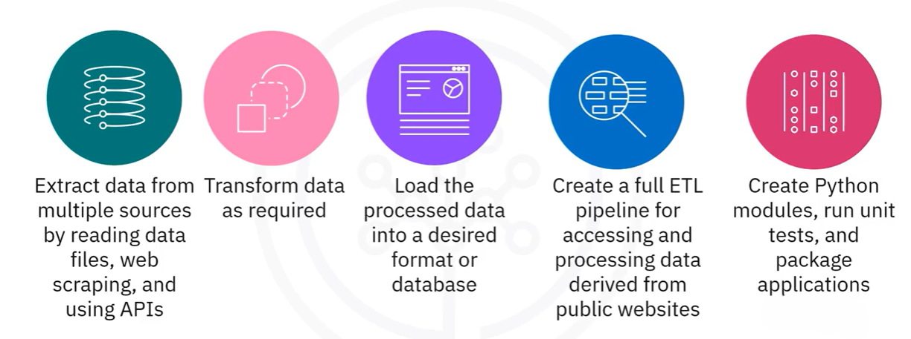

# Python Data Engineering Project: Global Banks Data

## Project Objective:

Develop a program to compile a list of the world's top banks ranked by market capitalization in billion USD. The data should be collected using web scraping techniques from reliable financial websites. This data should then be converted and stored in GBP, EUR, and INR, based on exchange rate information provided in a CSV file. The processed information must be saved locally both as a CSV file and as a database table.

## Project Sequence 

## Python Data Engineering Process:

1. Initialize a logging function that tracks the process step.
2. Initialize a web scraping function that will parse thru a webpage and collect necessary data.
3. Initialize a transformation function that will Transform data to the required format.
4. Save the transformed data in a ready-to-load format, which can then be loaded into an RDBMS.

## Web scraping and Extracting Data using APIs

1. Use the [requests], [BeautifulSoup] and [pandas] libraries to web scrape the contents of a web page.
2. Analyze the HTML code of a webpage to find relevant information.
3. Extract the relevant information and save in a CSV file.
4. Perform transformation on the extracted data that is assigning the correct data attribute, tranforming data into a different format, etc.
4. Load the dataframe into a SQL Database.